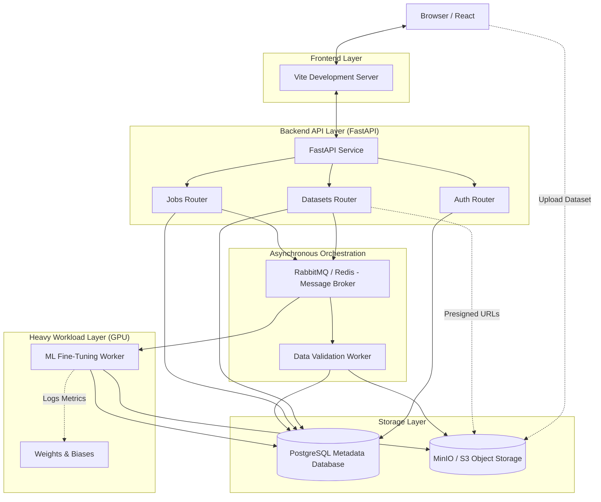

# Selftune Architecture

Selftune follows a decoupled, service-oriented architecture designed to handle long-running, resource-intensive machine learning workloads without interrupting the user experience.

## System Diagram

## Component Details

### 1. Frontend Service (React / Vite)
- **Responsibility:** Provides the UI for users to upload datasets in JSONL format, configure fine-tuning hyperparameters, select base models, and monitor job statuses.  
- **Interaction:** Interacts directly with the FastAPI backend. For large file uploads, it negotiates a MultiPart direct upload via presigned S3 URLs from the backend.

### 2. Backend API (FastAPI)
- **Responsibility:** Serves as the primary gatekeeper. It handles user authentication, data management (storing dataset references), job creation, and overall metadata management in PostgreSQL.
- **Interaction:** Pushes tasks to the RabbitMQ broker using Celery when asynchronous background processing is needed.

### 3. Asynchronous Task Queue (Celery + RabbitMQ)
- **Responsibility:** Manages the lifecycle and state of long-running operations. Decouples the fast API response logic from the heavy processing logic.

### 4. Validation Worker
- **Responsibility:** Executes the 4-stage data validation pipeline for uploaded JSONL datasets (Format, Tokens, Duplicates, Toxicity score).
- **Interaction:** Downloads the uploaded file from S3, parses it, scores it against a toxicity API, and updates the database with a ValidationReport.

### 5. ML Worker (GPU-enabled)
- **Responsibility:** The core engine that trains the model. Isolated in its own container to prevent its heavy dependencies (`peft`, `transformers`, `torch`) from interfering with the API layer.
- **Interaction:** Picks up a job, fetches the base model from Hugging Face Hub, applies LoRA configuration via `peft`, executes the training loop, logs live metrics to `wandb`, and finally uploads the tuned `adapter_model.bin` weights to S3.

### 6. Storage Layer
- **PostgreSQL:** Stores structured relational metadata (`User`, `Dataset`, `FineTuningJob`, `TunedModel`).
- **MinIO (S3-compatible):** Stores the massive blobs of unstructured data (the raw `.jsonl` datasets and the finalized model adapter weights). This prevents database bloat.
